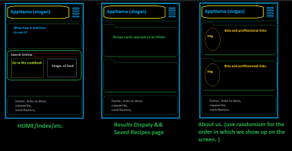
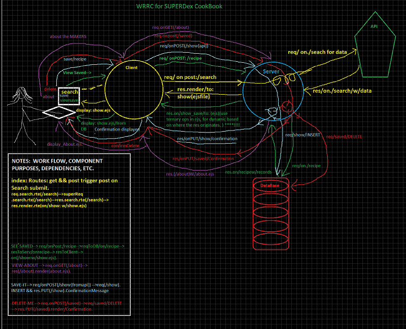
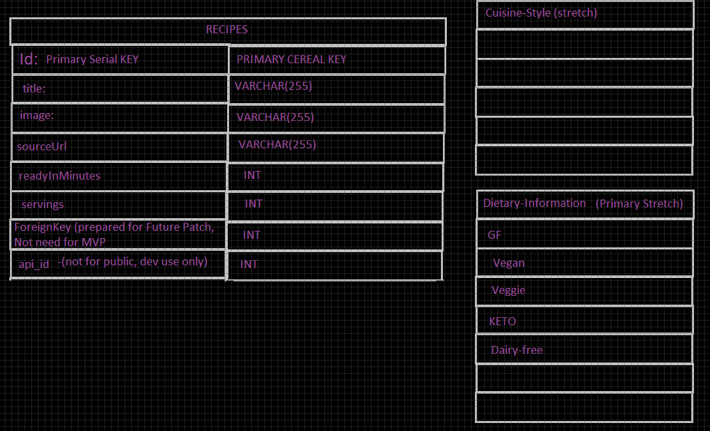

# Digital Cookbook
Code Fellows 301 Group Project

Version: 1.0.0

## Group
Dave Wolfe, David Palagashvili, Marlene Rinker, Mason Fryberger

## Description
The Digital Cookbook is an app that allows you to find recipes and save them for easy reference.

## Getting Started

```environment variables
PORT=3001
DATABASE_URL=postgres://localhost:5432/<name of your database>
SPOONACULAR_API_KEY=<get api key from spoonacular.com and put it here>
  ```
  Packages to install:

    "cors"
    "dotenv"
    "ejs"
    "express"
    "method-override"
    "node"
    "pg"
    "superagent"

  API: [spoonacular API](https://spoonacular.com/food-api)  


## Resources and Credits

[Alt Images from lorempixel](https://lorempixel.com/)

[Spoontacular API](https://spoonacular.com/)

## Wireframes




## User Stories
[Link to Trello Board](https://trello.com/b/ZByT6NRl/super-cookbook)

### Story 1: Search For Recipes

As a user, I want to be able to find recipes based on criteria I enter.

Feature tasks: 

- Create a form where the user can enter search criteria

- Use an API to search for recipes based on the user's search criteria

- Display the results to the user

Acceptance tests:

- A form exists where the user can enter search criteria

- After the user submits the form, an API is used to search for recipes based on the user's search criteria

- The search results are displayed to the user


### Story 2: Save Recipes

As a user, I want to be able to save recipes for easy access later.

Feature tasks:
- Give users the ability to save a recipe from their search results

- List saved recipes on a page so users can see all of their saved recipes in one place

- Give users the ability to access their saved recipes from other pages of the app

Acceptance tests:
- Users have the ability to save a recipe from their search results

- Users can see all of their saved recipes listed on a page

- Users can access their saved recipes from other pages of the app

### Story 3: Delete Recipes

As a user, I want to delete saved recipes I don't want to use anymore.

Feature tasks:

- Give users the ability to delete a saved recipe

- Remove the recipe from the list of saved recipes

Acceptance tests:

- User can delete a saved recipe

- After a user chooses to delete a recipe, it no longer appears on the page that shows saved recipes

### Story 4: Learn About App Creators

As a user, I want to know about the people who created this app.

Feature task:
 - Create a page in the app that tells the user about each of the app creators

 - Make the page accessible from other pages in the app

Acceptance tests:

- Users have the ability to see a page that contains information about each of the app creators

 - Users can access this page from other pages in the app


### Story 5: Good User Experience

As a user, I want the app to be pleasing to look at and easy to use.

Feature task:
- Create a simple design for the pages in the app

- Use consistent styles, colors, headers, and footers across the app

- Make the layout responsive for mobile and larger screens

Acceptance tests:

- The app is easy to use. It's clear what that app does, what each page is for, and what the available options will do.

- The app has consistent styling, layouts, and a pleasing color palette throughout.

- The app looks good on both mobile and larger screens.

### Domain Modeling




### Database Entity Relationship



